# RUST
Buy the course at : https://www.udemy.com/course/master-the-rust-programming-language/?kw=rust+pro&src=sac&couponCode=ST21MT30625G1
# 1. hello_world_001

        use ferris_says::say; // from the previous step
        use std::io::{stdout, BufWriter};

        fn main() {
        let stdout = stdout();
        let message = String::from("Hello fellow Rustaceans!");
        let width = message.chars().count();

        let mut writer = BufWriter::new(stdout.lock());
        say(&message, width, &mut writer).unwrap();
        }
# 2. print_002
# 3. EMI_calculator
#### important notes
- {:.}2 - 2 decimal places 
- :#X - convert to Hexadecimal
- :#b or :b 
- :p to print a raw pointer 
- r and r# can be used in place \ to escape special characters that may confuse the compiler , such as \ , "", etc
## useful rust tools
#### rustfmt - for formating your code for best readability
       //example usage
       cargo fmt
#### CLippy
        //you can add it to to Settings JSON file
        "rust-analyzer.check.command": "clippy"
#### cargo fix 
        cargo fix --help

# 4. Variables and Data Types
### Data Types (Primitive)
- Integers: i8 , i32, i64, isize , u8 , u16, u32, u64, usize
- Floating-point numbers: f32, f64
- Boolean : bool
- Character: char
- Arrays : [T;N], where T is the type elements and N is the number of elements
- Slices : &[T]
- Tuples: A tuple is a fixed-length collection of elements, where each elememt can have a different type. They are defined by a set of closing parenthesis enclosing comma-seperated list of typea (T1, T2, T3, ...)

#### defining variables
        let num = 32; // defaults to i32 
        let num: i32 = 100;
        // type casting 
        let num1: i32 = 400;
        let num2: i32 = 30;
        let result: i8 = (num1 + num2) as i8;  // without type casting it will throw an error
        println!("Sum = {}", sum);
####  mutable and immutable data types
- defininhg a variable with let , automatically makes it immutable, once assigned it can not be reassigned to a new value
- you can make it mutable by defining it with the keyword mut

        let num = 10;
        let mut sum = 0;
        sum = num + 50;
#### "as" keyword
- The "as" keyword is used for explicit casting, meaning it is used to convert a value from one primitive type into a value of another primitive type
- "as" is also used to rename imports in use and extern crate statements 

- suffixes to specify the type of a number 

        let num1 = 100_u8
        let num2 = 0xffffu32
        let num3 = 0.5_f32

#### Storing ascii code 
        //converting from ascii to u8
        let ascii_code_of_plus = b'+';
        println!("{}", ascii_code_of_plus); // thos will print out the value of + = 43 

        //converting from u8 to ascii
        let ascii_number = 43_u8;
        println!("{}", ascii_code_of_plus as char); // output will be '+'

#### Unicode Scalar values 
        //uses '\u{}'
        let infinity_symbol = '\u{221E}'; // 221E is a Hexadecimal value without 0x prefix
        println!("symbol = {}, usv = {}", infinity_symbol, infinity_symbol as u32)

        // converting from u32 to char
        // TO convert a u32 value to a char, you can use the char::from_u32 function, which return Option<char>

        fn main(){
                let inf_usv = 0x221e_u32;
                if let Some(inf_symbol) = char::from_u32(inf_usv){
                        println!("Symbol = {}", inf_symbol);
                }
                else{
                        println!("Not a valid Unicode scalar value");
                }
        }
#### Arrays

        // they type and size of an array can inferred by the compiler , but generally this is how it is defined
        let my_array: [f64; 3] = [2.5, 4.0, 3.8];
        let my_array1 = [2.5, 4.0, 4.2]; // this also works , by the compiler 
        
- since size of an array can not be modified at run tim, RUST does have a dynamic alternative to arrays called Vectors chich can change in size
- Vectors are implemented as a wrapper around dynamically allocated array and provide methods to push and pop elements , as well as other useful functionality. So in RUST you can usea Vector if you want a dynamic array

- printing an array 
        
        let array = [1, 2 ,3];
        // {:?} or {:#?} format specifier uses
        // Debug trait of the array which is used to print arrays in a concise and readable format , because 
        println!("{:?}", my_array);
        println!("{:#?}", my_array);

- Repeat expession

        let array: [i32 ; 10] = [0;10]; // creates an array and initializes with 10 zeros of type i32
        let buffer = [0_u8; 1024]; // creates a 1kb buffer
        println!("{:?}", buffer);

- Array indexing 

        let array1 = [5,4,3,2,1];
        let element = array1[3];
        println!("{}", element)

        //you can create a mutable array as follows
        let mut array2 = [4_u8; 5];
        array2[3] = 10;
        println!("{:?}", array2); // [4,4,4,10 , 4]

- Iterating over an array

        let array = [10, -67, 88, -5, -2, 99, 132, 42]; //[i32, 8]

        let mut sum = 0;
        for i in array{
                sum+=i;
        }
        println!("{}", sum);

# 5. Military time converter
1. calculate the values of 3 fields in HH:MM:SS. HH denotes Hours, MM denotes Minutes, and SS denotes Seconds.

2. To calculate Hours(HH) use the below formula

Hours = total_seconds/3600;

Note: total_seconds is the value entered by the user.

3. Find out the remaining seconds using the mod(%) operator

remaining_seconds = total_seconds % 3600

4. To calculate Minutes(MM) use the below formula

Minutes = remaining_seconds / 60

5. Find out the remaining seconds using the mod(%) operator which also happens to be the Seconds(SS)

Seconds= remaining_seconds % 60

6) Print in the format : HH:MM:SS

#### taking input 

        use std::io::{self, Write};
        println!("Please enter the time in seconds: ");
        io::stdout().flush().unwrap();
        let mut buf = String::new();
         io::stdin()
        .read_line(&mut buf)
        .expect("Enter valid time in seconds!");

        let time_seconds: i32 = buf.trim().parse().expect("enter a valid integer");

# 6. Functions

        fn convert(initial_value: f64)->f64{
                retun initial_value/3600;  //return statement can also be skipped , and removing the semicolon
        }
- RUST does not allow functions to have the same name , but you can do it using modules 

        mod module_1{
                pub fn convert(initial_value: f64)->f64{ //pub makes the function public because when inside the module it is private 
                        initial_value/3600
                }
        }
        mod module_2{
                pub fn convert(initial_value: i32)->i32{
                        initial_value/3600
                }
        }

        fn main(){
                module_1::convert(4.00); //put the full path when calling it.
        }
# 7. Why RUST is safe 
- No null pointer dereference
- No use after free
- No dangling pointers 
- No double free
- No buffer overflows
- Memory leaks are mostly( No language completely avoids them in all scenarios)
- No Data races (thread accessing memory location at the same time )
- No uninitialized memory access
- No type confusion
        
        static FAIL_SAFE_MODE: AtomicBool = AtomicBool::new(false);
        
        fn main(){
                panic::set_hook(Box::new(|info| {
                        FAIL_SAFE_MODE.store(true, Ordering::SeqCst);
                        println!("Panic occured: {}", info);
                        println!("Entering fail-safe mode...");
                        let buffer = [1,2,3,4,5];
                }));

                let result = panic::catch_unwind(||{

                        for i in 0..10{
                                //panics for i>=5
                                println!("Accessing index {}: {}", i , buffer[i]);
                        }
                });

                if FAIL_SAFE_MODE.load(Ordering::SeqCst){
                        println!("System is now in fail-safe mode.");
                }

                match result{
                        Ok(_)=> println!("No panic occured."),
                        Err(_)=> println!("Panic caught! Execution Continues")
                }
        }
# 8. Testing
1. Unit testing: Tests individual functions, methods, or modules in isolation to ensure that they perfom as expected.
2. Integration Testing: Tests the integration of multiple components or the entire module as a wholeto ensure they work together correctly
3. Documentation Testing (Doc-Tests): Ensures that code examples in documentation are accurate and executable.

- Rust does not natively support mocks. You can create mocks manually or use third party libraries.

## Software development practices 
- Test-Driven Development (TDD) - write the test cases first - write code to pass test case (iterate)
- Test-Last Development - tests are written after the code has been developed

        #[cfg(test)]
        mod tests{
                // helper function used by test cases 
                fn helper_functio(){

                }
                #[test] //this attribute tells cargo to treat this function as a test case (can only be executed using the command cargo test)
                fn test_your_test_case_1(){

                }
                #[test]
                fn test_your_test_case_2(){

                }
        }
# 9. References
- can be thought of as a pointer in C, in thesense that it refers to the memory location of a value. They are different from pointers from C in that:
1. References are immutable
2. Cannot be null and will never dangle
3. The borrow checker ensures that the reference will only be valid for the lifetime specified and will not outlive that lifetime

        fn main(){
                let value: i32 =  42;
                let ref_of_value = &value; //immutable reference
                println!("Value is {}", *ref_of_value); // Manual dereferencing
                println!("value is {}", ref_of_value);  // Automatic dereferencing
                println!("memory address of stored value is {:p}",ref_of_value ); 
                println!("memory address of stored address is {:p}",&ref_of_value ); 
        }
### Slice 
- slice is used to reference a portion of an array but they can also be used to reference other types of contiguous data structures, such as a string or a vector.
- The true power of a slice lies in its ability to let you work with a portion of data efficiently, without taking ownership , copying or allocation

        fn main(){
                let array: [i32; 4] = [1,2,3,4];

                let s1 = &array[1..=3]; // s1 is a slice whose type is &[i32]
                let s2 = &array[..]; // the entire array
                let s3 = &array[0..2]; // 0 to 2 not inclusive of 2
                println!("{:?}", s1); //output is [2,3,4]

                //start..end  -> start<=x<end
                //start..=end -> start<=x<=end
                //start.. -> start to the rest
        }

- Modifying from a slice 

        fin main(){
                let mut array = [-56, -1, 10 , 20 , 70 , 400];
                let s1 = &mut array[1..=4]; // for us to modify the from the slice the slice itself has to be muatble and has to follow the rules
                s1[2] = 100;
                println!("{:?}", array); // the output is  [-56, -1, 10, 100, 70 , 400]

        }
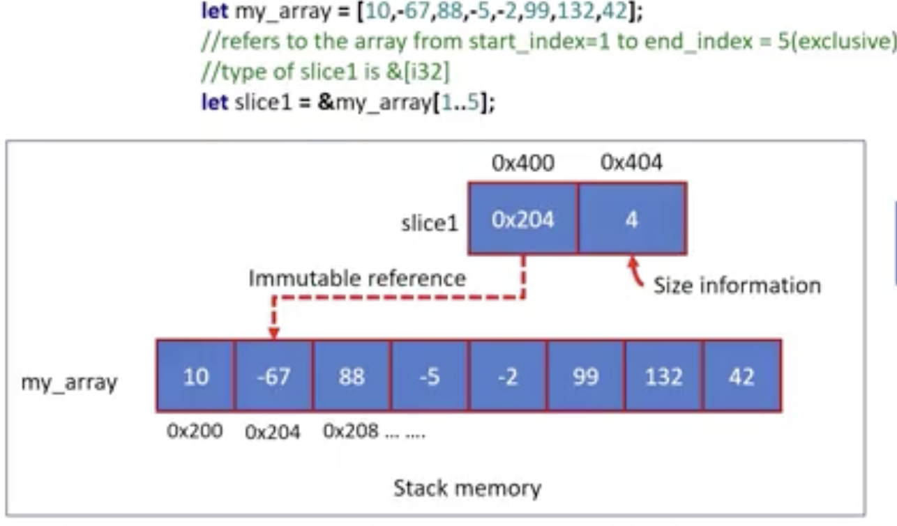

#### looping through an array 
        fn main(){
                let array = [-56, -1, 10 , 20 , 70 , 400];
                let slice = [0..=3];
                let mut sum = 0;
                //type of slice is &[i32]
                //i is a loop variable which is a reference not the actual value, and it is of type &i32, although it works , the compiler figures that out
                for i in slice{       // this also works for &i in slice{}, and in that case the type i will i32 instead of &i32
                        sum = sum+*i; // this also works sum = sum + i
                }
                println!("sum: {}", sum);
        }

### Borrow , Borrower and Referent

##### Mutable Borrow
        fn main(){
                let mut num1 = 42;
                let ref_of_num1 = &mut num1; // adding the mut before the num1 make the reference to be mutable
                *ref_of_num1 = 100;
                println!("{}", num1) // the code works , the output is 100
        }

                fn main(){
                let mut num1 = 50;
                let r1 = &num1; // type of 'r1' is &i32
                let r2 = &mut num1; //type of 'r2' is &mut i32

        }
- RUST does not allow us to create multiple mutable borrows because the is a good chance of data race condition 
                fn main(){
                let mut num1 = 50; //mutable referent
                let r1 = &num1; // immutable borrow
                let r2 = &num1; // immutable borrow
                let r3 = &num1; // immutable borrow

        }

#### Array and Slice methods
- Reverse

        let mut array = [2,3,4,5,6];
        array.reverse();

- Sort

        let mut array = [3,5,1,3,6,7];
        array.sort(); // will sort in ascending order --- checkout docs for more sort functions

- Find the biggest

        //sort then return the last ;last index
        let mut array = [3,5,1,3,6,7];
        array.sort(); // will sort in ascending order --- checkout docs for more sort functions
        let length = array.len();
        println!("Biggest number: {}", array[length - 1])

- Concat

        let array1 = [1,2,3];
        let array2 = [4,5,6];
        let array3 = [array1, array2].concat();
        println!("{:?}+ {:?} = {:?}", array1 , array2 , array3);

- Split_at methods

         let mut array = [3,5,1,3,6,7];
         let (l,r) = array.split_at(2);
         println!("{:?}",l); // prints the left hand side of the split array 
         println!("{:?}",r);

# 10. Decision Making

- if... else
- if..else if ..else
- if..let
- match

#### If  Expression 
        let age = 15;
        let message = if age< 18{
                println!("This is the if statement"); //you have to terminate this with ;
                "you can not vote" // no need for ; because it is an expression
        } else {
                println!("This is the if statement"); //you have to terminate this with ;
                "you can vote"
        }
#### Match statement

        fn main(){
                let x: u8 = 1; // the match statement has to be exhaustive for instance we said x is of type u8 , which means you have to handle values upto 127

                match x {
                        1 => println!("one"),
                        2 => println!("two"),
                        _ =>println!("Something else"), // _ means other cases
                }
        }
        // the output for this code is "one"

        //another example
        fn main(){
                let array1 = [1,-2,3,4];

                let invalid_array = match array1{
                       [n, _ , _ , _ ]|  [_, n , _ , _ ]|
                       [_, _ , n , _ ]|  [_, _ , _ , n ] if n < 0 =>{
                        true
                       }
                       _=> false ,
                };
                if invalid_array{
                        println!("Array is invalid");
                } else {
                        println!("Array is valid")
                }
        }

#### Matches statements 

        let invalid_array = matches!(array1 , [n, _ , _ , _ ]|  [_, n , _ , _ ]|
                       [_, _ , n , _ ]|  [_, _ , _ , n ] if n < 0 ); // this still works the same way as the above statement 

#### if..let, else if let 
- pattern matching like the match statement 

        fn main(){
                let point = (4,2);

                if let (0,0) = point{
                        println!("y is within the range 1..4");
                } else if let (_,y @ 1..=4) = point{
                        println!("y = {} is within the range 1..4", y);
                } else {
                        println!( "y is out of range");
                }
        }

#### Bitwise Operations 

| Hex | Binary | Hex | Binary |
| --- | ------ | --- | ------ |
| 0   | 0000   | 8   | 1000   |
| 1   | 0001   | 9   | 1001   |
| 2   | 0010   | A   | 1010   |
| 3   | 0011   | B   | 1011   |
| 4   | 0100   | C   | 1100   |
| 5   | 0101   | D   | 1101   |
| 6   | 0110   | E   | 1110   |
| 7   | 0111   | F   | 1111   |

        //Extract the 4th to 12th bit positions of the number
        fn main(){
                let num = 0x00ABCDEF;
                let mask  = 0x1FF << 4 ; // to mask we use 1 1111 1111, which is converted to hexadecimals to 0x1FF , but we left shift it by 4 positions

                let res = ((num & mask)>>4) & 0x1FF; // & 0x1FF is the optional final clean up to ensure we have 9 bits , its a common defensive habit
                println!("{:#X}", res )
        }
        /*
        num  = 0x00ABCDEF           0000 0000 1010 1011 1100 1101 1110 1111
        mask = 0x00001FF0           0000 0000 0001 1111 1111 0000 0000 0000
        -------------------------------------------------------------------
        num & mask = 0x00000DE0     0000 0000 0000 0000 1101 1110 0000 0000
        */

# 11. Convert 32-bit RGBA8888 color format to 16-bit RGB565 color Format Exercise
Write a program which accepts 32-bit RGBA8888 color format in hex  from the user and converts that into 16-bit RGB565 color format

 Hints
 ============================

1) Extract the red, green, and blue components from the 32-bit RGBA input.

2) Scale down these color components to fit the RGB565 format, which allocates 5 bits for red and blue, and 6 bits for green.

For example if 0xABCDEFEE is in RGBA8888 format, in binary it would look like below

    10101011(R)   11001101(G)   11101111(B)   11101110(A)

    to convert this into RGB565,

i) Neglect A

ii) in R consider only most significant 5 bits

iii) in G consider only most significant 6 bits

iv) in B consider only most significant 5 bits

3) Removing Hex prefix from user input:

Use the 'trim_start_matches' method on the string to remove the "0x" or "0X" prefix

4) To convert String to Integer U32 value , explore

u32::from_str_radix() with radix = 16

 - Expected Output
=============================

Enter RGBA8888 data in hex format: 0xABCDEFEE

0xABCDEFEE RGB565 equivalent is 0xAE7D

- FInd the code in rgba888_to_rgb565

# 12 Strings
##### Different types of strings in Rust 
1. String literal (&str) - UTF8 encoded characters , often created from a string literal in the source code. it has a fixed size.
        
        let message  = "Good Morning";// this is a string literal. The information "Good Morning " is hardcoded in the binary of the program

2. String: an owned , heap allocated string type, which provides methods for mutating its contents and has a dynamic size

        fn main(){
                let mut greeting = String::from("Good morning");
                let mut greeting = String::new(); // creating an empty string

                let mut num_string = 3.148.to_string(); // this also works on all datatypes that have access to the display attribute
        }
#### Memory representation
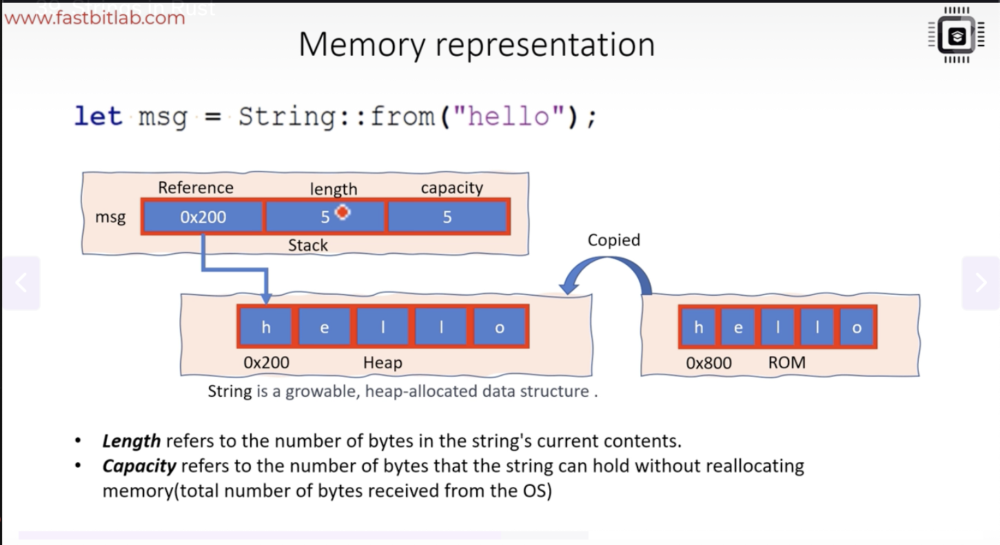

- Heap memory allocated to hold the string string will be deallocated automatically
### Copying for Strings 
1. Shallow copying 
2. Deep copying 

##### 1. Shallow copy
 - when a String value is assigneed to another variable, the varible is assigned a copy of the pointer, length , and capacity of the original String value, but the underlyig heap memory is not copied. This is also known as copy by reference

        fn main(){
                let s1 = String::from("hello");
                let s2 = s1; //s1 is no invalid, for integers this is not the case , String uses the heap memory that's why 
                println!("{}, world", s2); //s2 points to the same memory as s1
        }

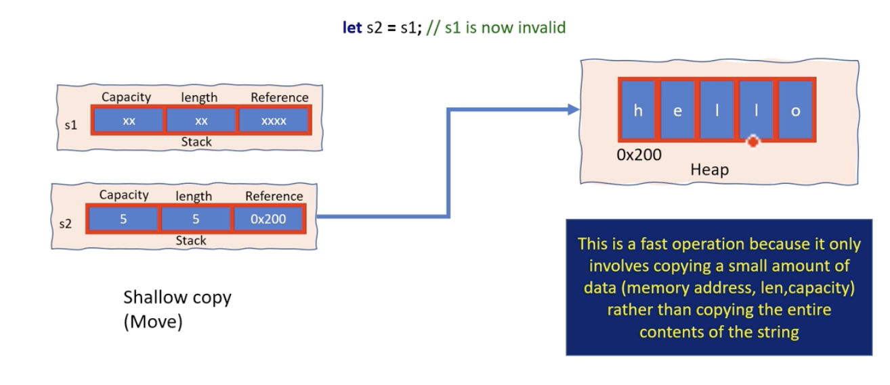

##### 2. Deep copy
- When a String value is cloned, a new heap allocation is created with the same contents as the original String. This is also know as copy by value.

* In rust Every piece of Data has a single owner at any given time. One exception is Reference Counted(RC) type 

         let my_string = String::from("Hello World");
         mystring2 = my_string.clone();

#### SLice of a String 
- similar to arrays 
- you can not modify the original string from a slice by indexing, it is of type &[T]

#### Converting a String into a slice or string literal

        fn print_string(arg: &str){
                println!("{}", arg);
        }

        fn main(){
                let s: String = String::from("Hello");

                let slice = &s; //type of 'slice is &String  --> &str'

                print_string(slice);
                let slice2 = s.as_str() //type of slice2 is &str

                let slice3 = s.as_str() //type of slice3 is &mut str
        }
#### Converting a string literal or slice  into a String

        fn main(){
                let s = "Good morning ";
                let string1 = s.to_string(); // type of string1 is String 
                let string = String ::from(s); // type of string is String 

        }

#### String to byte array
        fn main(){
                let message: String  = String::from("hello+∞+§);
                let byte_slice: &[u8] = message.as_bytes();
                for byte: &u8 in byte_slice{
                        print!("{:#X}\t", byte); //the output is out the above UTF8 is stored in the memory
                }
        }

#### Iterating on a string

        let computer_in_hindi = "ºª•∑¶§™£¢∞¶§•ªª¶§∞§¢™≥≤`¡";

        for ch in computer_in_hindi.chars(){
                print!("{}", ch);
                print!(" ");
        }

# Password Validity project 
        Write a program to check validity of a password input by users Following are the criteria for checking the password:
        1. atleast 1 letter between a-z
        2. atleast 1 number btween 0-9
        3. atleast 1 letter between A-Z
        4. atleast 1 character from [$#*]
        5. minimum length of password : 6
        6. Maximum length of password: 12

# 13. Ownership , Move and Copy Semantics
         // Move

         fn main(){

                let array1 = [5, 6, 7,8]; //[i32; 4] , these will be in the stack memory
                let array2: [String;3] = [
                        String::from("foo"),
                        String::from("bar"),
                        String::from("baz"),
                ];   // these will be in the heap memeory, but their refernces will be in the stack 

                //doing this will work because it is of type i32 , which has a copy trait

                let item = array1[2]; // this is because is it of copy trait , 
                let str_item1 = array2[1]; however this does not work for the String in rust because it make the reference to be invalid 

                // something that works is indexing as a slice 
                let str_item : &str = &array2[1];
                println!("{}", str_item);

                //looping through the String 
                for str in &array2{
                        println!("{}",str);
                }
                println!("{:?}", array2);

         }

#### &mut T and &T
- &mut T is Move while &T is Copy

#### Call by value and Call by reference 

        fn main(){
                let arr = [10, 20, 30, 40 , 50];

                // Call by value
                let max_value = find_greatest_value_by_value(arr);
                println!("Maximum value by value: {}", max_value);

                // Call by reference
                let max_value = find_greatest_value_by_reference(&arr);
                println!("Maximum value by reference : {}", max_value)
        }
        fn find_greatest_value_by_value(arr: [i32; 5])-> i32 {     // Copy
                //ToDo
        }
        fn find_greatest_value_by_reference(arr: &[i32])-> i32{   // Move
                //ToDo
        }

# 14. Loops

#### Loop : 
- used to create an infinite loop that continues indefinitely until a break statement is encountered within the loop

        fn main(){
                let mut i = 0;

                loop{
                        if i == 3{
                                break;
                        }
                        println!("i = {}", i);
                        i += 1;
                }
                println!("loop ends");
        }
        // Break with return value 
        fn main(){
                let mut i = 0;

                let result = loop{
                        if i == 3{
                           break i*2;
                        }
                        println!("i = {}", i);
                        i += 1;
                }
                println!("result = {}", result);
        }
        // Loops can also have labels 
        fn main(){
                'outer: loop{
                        println!("Outer loop");

                        'inner: loop{
                                println!("Inner loop");

                                loop{
                                        println!("inner loop2");
                                        break 'outer
                                }
                        }
                }
        }

#### while:
- used to loop over a block of code as a specified condition remains true, condition based iterating

#### while let 
- This is a variant of the while loop that allows you to match againsta pattern and extract variable from it , continuing to loop as long as the pattern matches

#### for in: 
- Used to iterate over a collection of items such as an array , vector , or range. It is similar to the for loop in other programming languages

#### iterating over an immutable reference

        fn main(){
                let words = 
                [
                        "hello".to_string(),
                        "world".to_string(),
                        "how".to_string(),
                        "are".to_string(),
                        "you".to_string(),
                ];
                //iterate by value
                for str in words{
                        println!("{}", str);
                }
                // this takes the ownership of the array and you can't print it after the for loop

                //iterate by reference , this does not take ownership rather it borrows
                for str in &words{
                        println!("{}", str);
                }
        }
#### iterating over mutable reference

        fn main(){
                let mut words = 
                [
                        "hello".to_string(),
                        "world".to_string(),
                        "how".to_string(),
                        "are".to_string(),
                        "you".to_string(),
                ];
                //iterate by mutable reference
                // type of 'str' is &mut String
                for str in &mut words{
                        if str == "hello"{
                                str .push_str("good morning");
                        }
                }

                println!("{:?}", words);

}

#### Iterating over a string slice

when using the for loop think of a type that implements an iterator

        let msg = "Hello world";
        let target_char = "l";

        let mut count = 0;
        
        // for c in msg: would not work because msg is not of iterator type 
        for c in msg.chars(){
                if c == target_char{
                        count+=1;
                }
        }

# 15. Palindrome Project 
- To determine if the given char array is a palindrome, loop over the array up to half its length. During each iteration of the loop, compare the character at the current index from the start of the array with the character at the corresponding index from the end of the array. If all matching characters are equal, then the array is a palindrome.

- the solution is in the palindrome project directory

# 16. Tuples 

- A tuple is a data structure that allows you to group together multiple values of different types into a single, ordered collection.

        let my_tuple = (1 , "hello", true);
        let my_tuple: (i32, &str , bool) = (1, "hello", true);
        prntln!("{:?}", my_tuple); // does not implement the display trait therefore uses the debug trait

- Tuples in Rust do not have a named parameters. instead, the elements of a tuple are accessed by their position using indexing starting at 0.

        let number = my_tuple.0;  //indexing 
        let msg = my_tuple.1; 
        let boolean = my_tuple.2;

        // tuple destructing syntax
        let (number , message, is_valid) = my_tuple;

##### Mutable tuple 

 fn main(){
        let mut number = (1, 2, 3);
        increment_numbers(& mut number);
        println!("{:?}", number);
 }

 fn increment_numbers(num_list: &mut (i32, i32, i32)){
        num_list.0 += 1;
        num_list.1 += 1;
        num_list.2 +=1;
        // Rust provides automatic dereferencing for method calls and field access when you have a reference to an object such as a tuple,, or an object of a struct or enum

 }
 
 #### Tuples can be nested 

        let grid = ((1,2,3), (4,5,6), (7,8,9));
        println!("Middle element: {}", grid.1.1);

#### Pattern matching in tuples : Tuples comparison 

- Tuples can also be compared lexicographically using operators like ==, != , <, >, <=, and >= as long as all the types in the tuple implemenmt the PartialOrd and PartialEq trait 

- The PartialOrd trait is used to define the ordering relationship between two values , while the PartialEq trait is used to define the equality relationship between two values.

- Example : Process the middle element only when the first element is greater than 0 , the last element is less than 10

        fn main(){
                let rcvd_data = (5, "hello",  8);

                match rcvd_data {
                        (a,s,c) if a >0 && c < 10 => {
                                println!("Valid data: s = {}", s);
                        }

                        _ => println!("Invalid data"),  // match has to be exhaustive
                }
        }

        fn execute_command_refactored(mode: &str, status: &str) {

        match (mode, status) {

                ("admin","active") => {println!("Admin privileges granted. Executing active command.")},
                ("normal","pending") => println!("Normal operation. Execute pending or active commands."),
                ("maintenance","complete") => println!("Maintenance complete. System can resume normal operation."),
                _ => println!("No action needed or invalid mode/status."),
                
        }
        }
        
        
        fn main() {
        execute_command_refactored("admin", "active");
        execute_command_refactored("normal", "pending");
        execute_command_refactored("maintenance", "complete");
        execute_command_refactored("admin", "pending");  
        }

#### pattern matching with tuple using the rest operator (..) to ignore some elements 

        fn main(){
                let tup = (1, "hello", 2.5. true. 'a');

                match tup {
                        (_, _, c , ..) if c > 2.0 => println!("The third element is greater than 2.0"),
                        _ => println!("The third element is less than or equal to 2.0"),

                }
        }

- The .. syntax is called the "rest" operator in Rust. It can be used in destructing pattern to match any remaining elements in a tuple , array , or struct

#### pattern matching with tuple  using variable binding and rest operator

        fn main(){
                let tup = (10, "hello", 2.5 , true , 'a');

                match tup{
                        (a@10, b @ "hello", ..)=> println!("The first and second element: {} and {}", a , b),
                        _ =>println!("The tuple does not match the pattern"),
                }
        }

#### Move while matching 
Remember this 
- i32 -- copy 
- String -- move 

- ref is the possible fix for this 

#### ref keyword

        fn main(){
                let the_date = (
                        "Monday".to_string(),
                        "25".to_string(),
                        "June".to_string(),
                        "2023".to_string(),
                );

                match the_date{  // alternatively you can use  &the_date , instead of ref to borrow the whole tuple
                        (ref day, ..) if day .as_str() == "Sunday" =>{
                                println!("Its Sunday");

                        }
                        _ => println!("Some other date"),
                }
                println!("{:?}", the_date); // this will print out the the_date without an error , because of the ref word which allows the match to borrow rather than move which happen if the ref is not used
        }
        

# 17. Fruits Sort Project 
You are required to write a program to sort the (fruit-name, price, quanity) tuples by

ascending order where fruit-name is string, price and quantity are numbers.

1: Sort based on fruit-name;

2: Then sort based on price;

3: Then sort by quantiy.

The priority is that fruit-name > price > quantity.

If the following tuples are given as input to the program:

Mango-us,50,80

Mango-uk,50,80

Orange,19,80

Blackberry,20,90

Blueberry,17,91

Blueberry,17,93

Blueberry,21,85

Expected output:

("Blackberry", 20, 90)

("Blueberry", 17, 91)

("Blueberry", 17, 93)

("Blueberry", 21, 85)

("Mango-uk", 50, 80)

("Mango-us", 50, 80)

("Orange", 19, 80)

Hint :

1) Remember you can compare the tuple lexicographically.

2) Use bubble sort. logic is given in the code.

You need to compare the ith tuple with the (i+1)th tuple and swap them if necessary

3) Use swap() method for swapping array elements (https://doc.rust-lang.org/std/primitive.slice.html#method.swap)

# 18. Structs
- Structs are user-defined data types that enable you to organize and encapsulate related pieces of data with different data types into a single unit, using named member fields for convenient access and manipulation.
- By defining a struct, the programmer can create a custom data type that is tailored to the needs of their.

        struct Person {
                name: String,
                age: u32,
                address: String, 
        }

#### Different types of structs
- There are three main types of structs in Rust :
1. Tuple struct : Struct that has unnamed fields 
2. Named struct: Struct that has named fields
3. Unit Struct: Struct that has no fields 

1. Named Struct 

        struct Person{
                name: String,
                age: u32,
                address: String,
        }

        fn main(){
                let person = Person{
                        name : String::from("Alice"),
                        age: 25,
                        address: String::from("123 Main St"),
                };
                // use the dot (.) operator to print the values of each member element 
                println!("Name: {}", person.name);
                println!("Age: {}", person.age);
                println!("Address: {}", person.address);
        }

- Mutable struct 
        #[derive(debug)]  //inorder to print the struct, it does not implement the debug or display trait therefore this is the way
        struct Person{
                name: String,
                age: u32,
                address: String,
        }

        fn main(){
                // create a new mutable Person struct
                let mut person = Person{
                        name : String::from("Alice"),
                        age: 25,
                        address: String::from("123 Main St"),
                };

                person.name = String::from("Bob"); // this works because of the mut keyword

                //print the updated struct
                println!("{:?}", person);

                //move 'name' field of struct is uninitialized 
                // let _name = person.name;
        }

#### Structs copy or Move ?
- Structs are by default Move irregardless of their member contents , but you can make them to be copy if their member elements are copy eg i32 using the derive trait

        #[derive(Copy , Clone, debug)] 
        struct Person{
                x1: i32,
                x2: i32,
                x3: i32,
        }

#### Default trait 
- as we know we have to initialize a struct , you can actually give the struct default values using the default trait

        #[derive(Debug, Default)]
        struct Person{
                name: String,
                age: u8,
                is_male: bool,
                height: f32,
                initial: char,
                address: String,
        }

        fn main(){
                // create a new mutable Person struct
                let user= Person::default();
                println!("{:?}", user);

        }

#### Updating a struct using another struct 

- they have to be of the same type

        #[derive(Debug)]
        struct Person{
                name: String,
                age: u8,
                is_male: bool,
                height: f32,
        }

        fn main(){
                // create a new mutable Person struct
                let user1= Person{
                        name: String::from("Ronie"),
                        age: 23,
                        is_male: true,
                        height: 5.4

                };

                let user2= Person{
                        name: String::from("Leslie"),
                        ..user1

                };

                let user3= Person{
                        name: String::from("Sam"),
                        ..user1

                };
                println!("user3: {:?}", user3);

        }

#### Tuple Struct

- Tuple structs are similar to tuples in that they don't have named fields . Instead, the fields are accessed by their index within the tuple. However unlike the normal struct the tuple structs posses a name , which can be advantageus in providing additional context and clarity to the code

        struct Point (i32, f64, u8;)

        fn main(){
                let point = Point(10, 3.5, 1);
                println!("x: {}, y: {}, z: {}", point.0, point.1, point.2);
        }
         
#### Methods and associated  functions of a struct

##### Methods 
- Methods are associated with a specific instance of the struct or enum
- Methods are defined within the impl block for the struct or , and their first parameter is always a reference to the instance of the struct or enum
- struct methods are accessed using instance of the struct followed by the dot(.) operator. For example, if we have an instance of the Person struct named person with a method named introduce, we can access it as person.introduce().

##### Associated functions
- Associated functions are not tied to any particular instance and are called on the type itself.
- Associated functions are defined within the impl block as well,  but their first parameter is not a reference to the type.
- Associated functions are accessed using the struct's name followed by the double colon (::) operator
- For example, if we have a struct named Person with an associated function new, we can access it as Person::new().

        struct MyStruct {

        }
        // f1() and f2() are methods / associated functions of 'MyStruct'
        // Put them inside impl  <Struct-Name> block

        impl MyStruct {
                fn f1(...){
                        .....
                }
                fn f2(...){
                        ......
                }
        }

        fn main(){
                // create an instance of 'MyStruct'
                let struct_inst = MyStruct{
                        ......
                };
                // METHOD CALL
                struct_inst.f1();
        }

- Another Example
* self keyword in a struct method signifies the instance of the struct on which the method is being called. It is analogous on which the method is being called. It is to 'this ' in many other OOP languages

- Associated 
        //Associated function 
                struct Point {
                x: f32,
                y:f32,
        }

        fn distance_from_origin(point: &Point)-> f32 {
                (point.x.powi(2) + point.y.powi(2)).sqrt()
        }

        fn main(){
                let p = Point{x:3.0, y: 4.0};
                println!("distance: {}", p.distance_from_origin(&p));
        }

- Methods 
        //Methods borrowing self immutably and mutably
        #[derive(Debug)] // to enable printing using the debug trait since it is not not implemented for the structs 
        struct Point {
                x: f32,
                y:f32,
        }

        impl Point {
                //Method borrowing self immutably
                fn distance_from_origin(self: &Point)-> f32 {    // this also worksfn distance_from_origin(&self)-> f32
                        self.x.powi(2) + self.y.powi(2).sqrt()
                }
                //Method borrowing self mutably
                fn translate(&mut self , dx: f32, dy: f32){
                        self.x += dx;
                        self.y += dy;

                }
                // Method that takes ownership of the self
                fn into_tuple()->(f32, f32){
                        (self.x, self.y)
                }
                // Using self as the first parameter of a method means the method takes ownership of the instance and consumes it, transforming it into something else. This is useful when you want to prevent the caller from using the original instance after the transformation.
        }

        fn main(){
                let mut p = Point{x:3.0, y: 4.0};
                println!("distance: {}", p.distance_from_origin());
                println!("modified Points: {:?}", p);
        }

- Associated functions
        #[derive(Debug)] // to enable printing using the debug trait since it is not not implemented for the structs 
        struct Point {
                x: f32,
                y:f32,
        }
        impl Point {
                //Method borrowing self immutably
                fn distance_from_origin(self: &Point)-> f32 {    // this also worksfn distance_from_origin(&self)-> f32
                        self.x.powi(2) + self.y.powi(2).sqrt()
                }
                //Method borrowing self mutably
                fn translate(&mut self , dx: f32, dy: f32){
                        self.x += dx;
                        self.y += dy;

                }
                // Method that takes ownership of the self
                fn into_tuple()->(f32, f32){
                        (self.x, self.y)

                }
                // Using self as the first parameter of a method means the method takes ownership of the instance and consumes it, transforming it into something else. This is useful when you want to prevent the caller from using the original instance after the transformation.

                // Associated function
                fnn from_tuple(coords: &(f32, f32))-> Point{
                        Point{c: coords.0, y:coords.1}
                }
        }

        fn main(){
                let mut p = Point{x:3.0, y: 4.0};
                let tuple = (10,20);
                let q = Point::from_tuple(&tuple);
                //println!("distance: {}", p.distance_from_origin());
                //println!("modified Points: {:?}", p);
                println!("Points from tuple: ({},{})", q.x,q.y);
        }

- Associated functions as constructor of a struct
        #[derive(debug, Default)]
        struct Rectangle {
                width: u32,
                height: u32,
        }
        impl Rectangle {
                fn new(w: u32, h: 32) -> Rectangle{   // it is a convention to use the word new for the constructor of the 
                        Rectangle {width: w, height: h}

                }

                fn new_with_default()-> Rectangle {
                        Rectangle::default()
                }

        }

        fn main(){
                let rect = Rectangle{
                        width: 10,
                        height: 20
                };
        }

##### Pattern Matching with structs 
        #[derive(debug, Default)]
        struct Rectangle {
                width: u32,
                height: u32,
        }

        fn main(){
                let rect = Rectangle {
                        width: 10,
                        height: 20
                };

                match rect {
                        Rectangle{ width : w , height : h} if w == h => {
                                println!("The rectangle is square.");

                        }, 
                        Rectangle{ width : _ , height: _ } => {
                                println!("The rectangle is not square.");
                        }
                }

        }

** Another Example **

        #[allow(dead_code)]

        struct Point {
                x: i32,
                y: i32,
        }

        struct Rectangle {
                top_left: Point,
                top_right: Point,
        }

        fn main(){
                let rect = Rectangle {
                        top_left: Point{ x: 0, y:10},
                        bottom_right: Point{x:20, y:0},
                };

                match rect{
                        Rectangle{ top_left: Point {x: 0, ..}, ..} =>{
                                println!("The top-left corner of the rectangle is on the x- axis")
                        },
                        Rectangle{..} => println!("The rectangle is somewhere else."),

                        }
        }
        

** Ref keyword and @ **

        #[derive(Debug)]
        struct Person{
                name: String,
                age: i32,
        }

        fn main(){
                let person  = Person{
                        name: "Ram".to_string(),
                        age: 35,
                };

                match person {
                        Person { age : p_age @30 , name: _} => println!("A person with age {}.", p_age),
                        Person  {ref name , age: 35} => {
                                println!("Ram with age 35 found.");
                        }
                        _ => println!("Not sure who the person is. "),
                }

                println!("{:?}", person)
        }

# 19. Enums

- An enum is typically used in any programming language to represent a value that cann be one of several possible variants
- when you define an enum in Rust, you are essentially creating a new type that can have one of several possible variants. Each variant can be associated with its own set of data, which allows you to represent complex data structures usng single enum.
- Enums have methods associated with them , just like structs 
        struct Point {
                x: i32,
                y: i32,
        }
        enum CarStatus {
                MovingUp (u32, i32, i32), // we can have something like this MovingUp{speed: u32, x: i32 , y: i32}
                MovingDown,
                NotMoving (Point),
                NotWorking,
        }

        fn main(){

                let current_car_status = CarStatus::NotMoving(Point{x: 0 , y: 0});

                current_car_status = CarStatus::MovingUp(100, 67, 78);

                //Pattern matching
                //if car is movingUp, print its Speed 
                // if car is NotMoving then print it x coordinate value 
                match current_car_status{
                        CarStatus::MovingUp(a, ..)=>{
                                println!(" Car is moving up with speed : {}", a);
                        }
                        CarStatus::NotMoving(x, ..)=>{
                                println!(" Car is not moving and x is  : {}", x);
                        }
                        _=> println!("Car is not moving"),
                }
        }

##### Methods and associated functions of an Enum

        struct Rectangle {
                x: f32,
                y: f32,
                h: f32,
                w: f32,
        }

        enum Shape {
                Circle {x:32 , y:32, radius : f32},
                Rectangle(Rectangle),
                Square(f32, f32 , f32),
        }

        impl Shape {
                fn new_circle(x: f32, y: f32, radius: f32)-> Shape {
                        Shape::Circle{x, y, radius }
                }

                fn area (self: &Shape) -> f32{
                        match self{
                                Shape::Circle {radius: r, ..} =>{
                                        std::f32::consts::PI * r * r
                                }
                                Shape::Rectangle(rec) =>{
                                        rec.h * rec.w
                                }
                                Shape::Square(_,_,s) =>{
                                        s*s
                                }
                        }

                }
        }

        fn main(){

                let new_shape = Shape::new_circle(0_f32, 2.0, 2.5);
                let area = new_shape.area();
                // print(area);

        }

##### Pattern matching usingg enums

        enum lightState {
             On { brightness: u8}  ,
             Off,
        }

        fn main () {
                let bulb = LightState:: On { brightness : 200};

                if let LightState :: On { brightness: 200} = bulb {
                        println!("Brightness is : {}", brightness);
                }
        }

##### The Option<T> type USAGE
###### Find the biggest string 

        fn find_biggest_item(strings: &[&str]) -> Option<&str>{
                let longest: Option<&str> = None;
                for item in strings{
                        if longest.is_none() || (item.len() > longest.unwrap().len()){
                                longest = Some(item)
                        } 
                }
                longest
        }

        fn main(){
                let strings = ["Mango", "Banana", "Apple"];

                let biggest_item = find_biggest_item(&strings);
                println!("Biggest item: {}", biggest_item.unwrap());
        }

        // Using the match 

        fn find_biggest_item(strings: &[&str]) -> Option<&str>{
                let longest: Option<&str> = None;
                for item in strings{
                        if longest.is_none() || (item.len() > longest.unwrap().len()){
                                longest = Some(item)
                        } 
                }
                longest
        }

        fn main(){
                let strings = ["Mango", "Banana", "Apple"];

                let biggest_item = find_biggest_item(&strings);

                match biggest_item{
                        Some(value)=> {
                               println!("Biggest item: {}", value); 
                        },
                        None => println!("Array is empty"),
                }
                
        }

# 20. Vectors

- A growable list type that stores elements contiguously in memory
- Vectors are growable and shrinkable at run time, which means you can modify their sizes at runtime by adding or removing elements. (Remember arrays in RUST ([T; N]) have a fixed size that's determined at compile time?)
- Supports random access , push, pop and other list like operations 

        fn main() {
                // This creates an empty vector , its type will be determined as soon as you start pushing data into it
                let mut v = Vec::new();   // if you want to explicitly mention the type : let mut v : Vec<i32> = Vec::new()

                // Push elements into the vector
                v.push(1);
                v.push(2);
                v.push(3);
                v.push(4);
                v.push(5);    // All this can also be implemented using a rust macro vec! let v = vec![1, 2, 3, 4, 5];

                for i in v{
                        println!("{}", i);
                }
        }

- Converting array to Vector

        let arr = [1, 2, 3 , 4, 5];

        let vec1 = arr.to_vec();
        let vec2 = Vec::from(arr);
        let vec3 = Vec::from([1, 2, 3 , 4, 5])
        let vec4 = Vec::from([10; 5]);

        //use debug trait , coz you know the drill for these data types 
        println!("{:?}", vec4)

#### Vectors under the hood
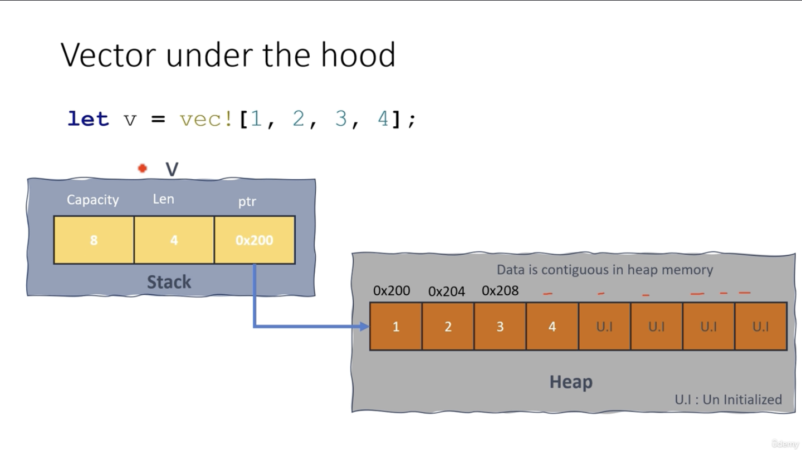

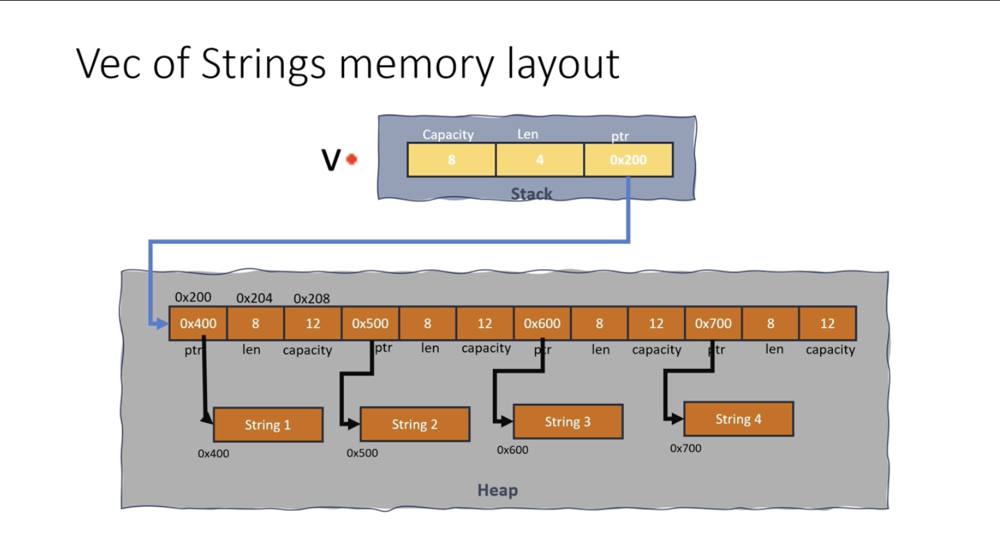

- **Vectors are move by default**

        let v = vec![1, 2, 3];
        println!("{}", v[0]);

- indexing in Rust for vectors 

        let v = vec!["Sun".to_string(), "Mon".to_string(), "Tue".to_string()];

        let s = &v[0]; // since strings doesn't allow copying then borrowing like this will be the best method

- **Safer Vector Indexing**

The safest way to access elements in a Vec is using the get and get_mut methods. They return an Option<&T> or Option<&mut T> respectively instead of panicking when faced with out of bounds indices 

        fn main(){
                let mut vec = vec![1,2,3];

                //Using get
                // val_ref is of type Option<&i32>
                let val_ref = vec.get(1);

                if let Some(val) = val_ref {
                        println!("Value : {}", val);
                }
                // Using get_mut
                // val_mut_ref is of type Option <&mut i32>

                let val_mut_ref = vec.get_mut(2);
                if let Some(val) = val_mut_ref {
                        // Dereferencing and modifying the value in place 

                        *val += 10;  // 13 will be the new value at index 2 
                }
                println!("{:?}", vec);
        }

###### Slice of a vector 

        let vec = vec![1, 2,3 ,4 ,5];

        let slice = &vec[1..4]; // A slice containing [2, 3, 4]

###### push()
- The push method is uded to append an element to the ned of the a Vec. It will increase the length by one

##### pop()
- When you call pop() on a Vec, it returns an Option<T> where T is the type of elements store in the vector.
- If the vector is not empty, pop() removes the last element, returns Some(value), and decreases the vector's length by one. If the vector is empty, pop() returns None

**Does the Vec shrink with every pop()?**
 yes in terms of its length(len()), but not in terms of its capacity (capacity())

 ##### shrink_to_fit();
 - this frees the excess memory to fit the vector size

 ##### drain()
 - The drain method on a Vec takes a single parameter which is a range. This range specifies the beginning and end of the swection of the vector to be drained
        
        fn main(){
                let mut v = vec![1,2,3,4,5,6];
                let _ = v.drain(1..3); this will drain values 2 and 3
                println!("{:?}", v);
        }

###### extract_if()
- this is a nightly build feature

        #![feature(extract_if)] // because it is nightly build not a stable feature

        fn filter_number(e: &mut i32) -> bool{
                *e>5
        }

        fn main(){
                let mut numbers = vec![1,2,3,4,5,6,8,9,11,13,14,15];

                let c1: Vec<_> = numbers.extract_if(filter_number).collect(); // extract_if() takes a closure as an argument
                println!("{:?}", numbers);
                println!("{:?}", c1);
        }

###### retain() and retain_mut()
- it allows you to keep only the elements that satisfy a given predicate while removing all others , its an inplace filter for a Vec

        fn main(){
                let mut numbers = vec![-3, -2, -1, 0, 1, 2, 3];
                // this will retain only positive numbers that are greater than zero
                numbers.retain(|x| *x > 0);

                println!("{:?}", numbers); //prints : [1,2,3]
        }

        // retain can also take a closure
        fn retain_positive(x: &mut i32) -> bool{
                *x>0
        }

        fn main(){
                let mut numbers = vec![-3, -2, -1, 0, 1,2 3];
                numbers.retain(retain_positive);
                println!("{:?}", numbers);
               
        }

        //retain_mut()
        fn retain_and_modify_positives(x: &mut i32) ->{
                if *x>0{
                        *x += 10;
                        true
                }else{
                        false
                }
        }
        fn main(){
                let mut numbers = vec![-3, -2, -1, 0, 1,2 3];
                numbers.retain(retain_and_modify_positive);
                println!("{:?}", numbers);  // [11, 12, 13]
               
        }

###### split() and friends
- The split method creates an iterator over subslices seperated by elements matching a predicate. It's a way to tokenize or divide a slice based on a given condition.
- The matched element is not contained in the subslices

        fn main(){
                let vec = vec![1,2,3,7, 11, 4, 33, 67, 8, 10];
                let subslices = vec.split(|e| e%2 == 0).collect(); // whenever closure returns true for an element , that element is treated as a splitpoint, and the original slice at that point (exclusing the element itself)
                for slice in subslices{
                        println!("{:?}", slice);
                }
        }
        // splitn()
        fn main(){
                let vec = vec![1,2,3,7, 11, 4, 33, 67, 8, 10];
                let subslices = vec.splitn(2,|e| e%2 == 0).collect(); //splits the vec to n subsets 
                for slice in subslices{
                        println!("{:?}", slice);
                }
        }
        //rsplit iterates from the end to the beginning (reverse)
        //split_off() - if you want to devide a Vec into two parts at a certain index and intend to use both parts independently afterwards

###### splice()
- the splice method is used to replace a specified range of elements in a vector with elements from an iterator

        fn main(){
                let mut primary_readings = vec![22, 23, 24, 0, 0, 0, 35, 25, 26, 27];
                // Backup readings for hours 4 to 6
                let backup_reading = vec![21, 24, 27];

                let faulty_readings: Vec<_> = faulty_readings.splice(3..6, backup_readings).collect;
                println!("corrected readings: {:?}", primary_readings);
                println!("faulty readings: {:?}", faulty_readings);
        }
###### append()
- appends two vectors , the source loses ownership 

###### extend()
- takes aniterator and extends the vector with elements from that iterator, compared to the append(), 

###### Prepend
- you can prepend using the insert method, the time complexity of insert is O(n) where n refers to the number of elements to the right of the specified index where the ne element is being inserted

        fn main(){
                let mut vec = vec![1,2,3];
                vec.insert(0, 25);
                println!("{:?}", vec);  //[25, 1, 2, 3]
        }
###### VecDeque<T>
- Double ended queue

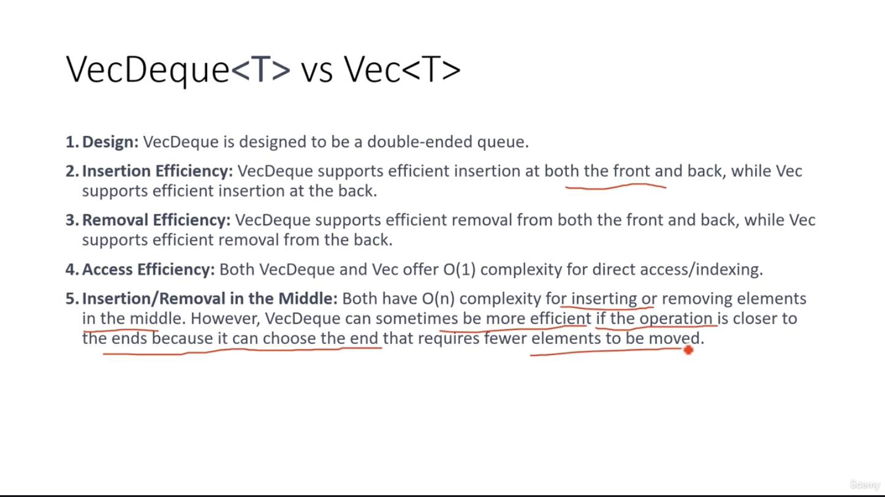
# 20 Simple Weather Station Application
- write a program to manage weather data for different cities
-  UML 
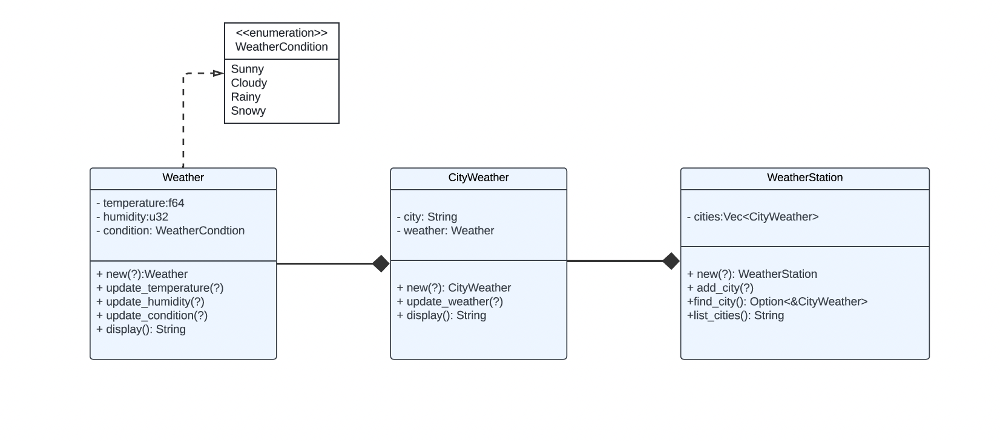

# 21 Simple library Management App
- Build a small command-line program that lets a user keep track of the books they own, lend out, and return. It exercises exactly the same core ideas you used in the weather app:

- enum for a small set of states
- struct compositions
- Vec<T> to hold many items
- methods (impl) for CRUD operations
- a simple, text-menu loop with input parsing

0 · Domain model (design first!)

        Concept coded
        BookStatus (enum)	 Available, Borrowed, Lost
        Book (struct)	         title, author, year, status: BookStatus
        Library (struct)	 books: Vec<Book>

##### Self , self , &self , &mut self 

        impl Something {
        fn new(args…)           -> Self          // build a fresh value
        fn read_only(&self)      { … }           // look, no touch
        fn change_me(&mut self)  { … }           // look AND touch
        }

**Quick mental model**

###### Type vs. value
- Self → the blueprint (“Weather card design”)
- self → one actual card in your hand
###### Immutable vs. mutable borrow
- &self → “peek at my card”
- &mut self → “here’s my card and a pencil—feel free to edit”

# 22 HashMap
- basically key value pairs

        use std::collections::HashMap;

        fn main(){

        // create a new HashMap
        let mut fruit_prices = HashMap::new();

        // Insert key-value pairs (fruit name as a key and price as value)
        fruit_prices.insert("apple", 1.2); 
        fruit_prices.insert("banana", 0.8); 
        fruit_prices.insert("cherry", 2.5); 

        // Access the price of a specific fruit 
        let apple_price = fruit_prices.get("apple").unwrap_or(&0.0);

        // Print the price 
        println!("The price of an apple is ${}", apple_price);

        // Iterate over all entries and print them 

        for (fruit, price) in &fruit_prices {   // & is referencing basically borrowing to avoid the transfer of ownership
                println!("{}: ${}", fruit, price);
        }
        
        }

        // Indexing works but will panic if value ifs not found
        println!("Price of an apple: ${}", fruit_prices["apple"]);

        // safe way to access values : using the get method 
        match fruit_prices.get("orange"){
                Some(price) => println!("Price of an orange: ${}", price),
                None => println!("Orange price doesn't exist"),
        }

        // you can also use built in functions sunch keys() and values()

###### Other very useful stuff
**Netsed HashMap** 
**entry()** - similar to get in python, let's say you want to check if a key exists , if yes then increment by 1 else by 0

        fn main({
                let mut fruits = HashMap::new();
                *fruits.entry("apple").or_insert(0) +=1;
        })
**or_insert()** - takes zero as an argument
- When you use or_insert(expensive_computatio()), the expensive-computation() function is executed before the or_insert is called , regardless of whether the key exists in the map or not. So everytime this line runs, expensive _computation() is called.

**or_insert_with()** - takes a closure as an argument 
- When you use or_insert_with(expensive_computatio()), the expensive-computation() function is executed only when the key does not already exist in the map. This is because or_insert_with() accepts a closure and only invokes it when needed

**and_modify()**
- The and_modify() method on the Entry enum is useful for modifying the value and associated with a key in a HashMap when the keyexists. It allowws manipulationfor in-place manipulation of the value needing to remove the key-value pair then reinserting it.
- Use and_modify() in conjuction with methods like or_insert() to handle both cases, when key is present (modify it's value) and when it's not(insert a default value)

        let mut fruits = HashMap::new();
        fruits.entry("apple").and_modify(|value| *value+=1).or_insert(1);
        

# 23 Error handling
- Result <T, E> is the type used for returnng and propagating errors. It is an enuk with the variants , Ok(T), representing success and containing a value, Err(E), representing error containing an error value.

        enum Result<T, E>{
                Ok(T),
                Err(E),
        }

- Functions returns Result whenever errors are expected and recoverabl. In the std crate, Result is most prominently used for I/O

- Rust offers several mechanisms for programmers to hadle errors in a safe and efficient manner.
1. Result Enum
2. Option Enum
3. Panic Macro
4. Unwrap() and expect() methods
5. ? Operator

**Result Enum**

        fn add_strings(s1: &str, s2: &str) -> Result<String, String>{
                if s1.is_empty() || s2.is_empty(){
                        return Err("Empty string is detected".to_string());
                }

                let c = format!("{}{}", s1, s2);
                Ok(c)
        }

        fn main(){
                let c = add_strings("hello", "");

                match c {
                        Ok(v) => println!("Result = {}", v),
                        Err(e) => println!("{}",e),
                }
        }

**ErrorPropagation Operator ?**
- this is the debug trait

        fn add_strings(s1: &str, s2: &str) -> Result<String, String>{
                if s1.is_empty() || s2.is_empty(){
                        return Err("Empty string is detected".to_string());
                }

                let c = format!("{}{}", s1, s2);
                Ok(c)
        }

        fn main()-> Result<(), AddStringError>{
                let c = add_strings("hello", "")?;
                println!("{}",c);
                Ok(())

        }

**Converting Option<T> to Result<T, E> type**

- use ok_or() - check documentation

        fn add_strings(s1: &str, s2: &str) -> Result<String, String>{
                if s1.is_empty() || s2.is_empty(){
                        None;
                } else { 
                        Some(format!("{}{}", s1, s2));}
        }

        fn main()-> Result<(), String>{

                let s1 = String::new();
                let s2 = String::from("World");
                let res = add_strings(s1, s2).ok_or("Strings can not be empty")?;
                println!("{}",res);
                Ok(())

        }
**Unwrap() and expect()**
- Both expect and unwrap are methods provided by the Option and Result enums for extracting their values.
- unwrap() simply returns the contained value of the Someor or Ok, and if the value is None or an Err, it will panic and terminate the program

        //unwrap
        fn add_strings(s1: &str, s2: &str) -> Result<String, String>{
                if s1.is_empty() || s2.is_empty(){
                        None;
                } else { 
                        Some(format!("{}{}", s1, s2));}
        }

        fn main(){

                let s1 = String::new();
                let s2 = String::from("World");
                let res = add_strings(s1, s2).unwrap();
                println!("{}",res);

        }
        //expect 
        fn get_user_input()->String{
                io::stdout().flush().expect("flush failed");
                let mut s = String::new();
                std::io::stdin().read_line(&mut s).unwrap();
                s.trim().to_string()

        }

**unwrap_err(), unwrap_or(fallback)**
- Unwrap_err() is a counterpart of unwrap , it panics when the result is not an error
- unwrap_or() is a method defined for Option and Result enums that returns the contained value of the Some or Ok variant or a default value provided as an argument if None or Err
        
        fn add_strings(s1: &str, s2: &str) -> Result<String, String>{
                if s1.is_empty() || s2.is_empty(){
                        return Err("Empty string is detected".to_string());
                }

                let c = format!("{}{}", s1, s2);
                Ok(c)
        }

        fn main(){

                let s1 = String::new("");
                let s2 = String::from("World");
                let res = add_strings(s1, s2).unwrap_err();
                println!("{}",res);

        }
        //unwrap_or()
        fn main(){

                let s1 = String::new("");
                let s2 = String::from("World");
                let res = add_strings(s1, s2).unwrap_or("Some Went wrong".to_string());
                println!("{}",res);

        }

**Standard Library Error types**

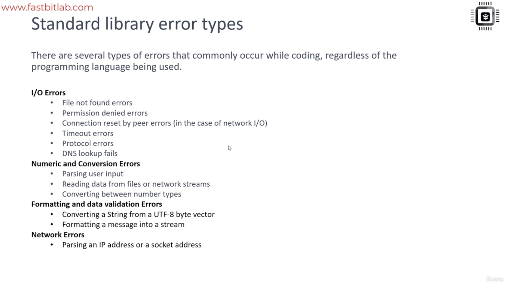 

**Handling I/O Errors**
std::io::Error is an error type provided by the Rust standard library's io module. The std::io::Error type is used to represent errors that occur during I/O operations, such reading or writing to a file or network socket

        use std::io;
        use std::fs
        fn rename_file(from: &str, to: &str)-> Result<(), io::Error>{
        // explore fs in the documentation to learn more about file system manipulation
               match fs::rename(from, to){
                Ok(_)=> Ok(()),
                Err(e)=> Err(e),
               }

        }
        //alternatively the above function  using ? 
        fn rename_file(from: &str, to: &str)->io::Result<()>{ //notice these changes here
               fs::rename(from, to)?;
               Ok(())

        }

        fn main(){
                let res = rename_file("log.txt", "output.txt");

                if res.is_err(){
                        println!("Rename failed");
                }else{
                        println!("Rename Successful");
                }
        }

**map_err()**
- instead of using match

        fn convert_err(e: std::num::ParseIntError) -> io::Error{
                io::Error::new(io::ErrorKind::InvalidData, format!("{}",e))
        }
        fn parse_integer_from_string(input: &str)-> io::Error{
                i32::from_str(input).map_err()
        }

        fn main()-> io::Result<()>{
                let mut user_input = String::new();

                io::stdin().read_line(&mut user_input)?;

                let result = parse_interger_from_string(&user_input);

                match result {
                        Ok(num) => println!("Parsed number: {}", num),
                        Err(e) => println!("Error parsing number: {}", e)
                }

        }
      
        //alternatively you can use closures
        fn parse_integer_from_string(input: &str) -> io::Result<i32>{
                i32::from_str(input).map_err(|e| io::Error::new(io::ErrorKind::InvalidData, format!("{}", e)))
        }

# 24 Inventory Management System

# 25 Generics
- suing generics you can write functions or types that can work with any type that meets certain requirements rather than being tied to a specific type.
- This makes yourcode more reusable and flexible since you can write code that can be used with various data types 

        use std::cmp;
        fn find_max_element<T: cmp::PartialOrd + Copy>(v:&[T])->Option<T>{
                if v.is_empty(){
                        return None;
                }

                let mut max = &v[0];

                for &n in v {
                        if n> max {
                                max = n;
                        }
                }
                Some(max)
        }

        fn main (){
                let arr_int = [1, 2, 3, 4, 5];
                let arr_float = [1.1 , 2.2, 3.3, 4.4, 5.5];
                println!("Max int: {:?}", find_max_element(&arr_int));
                println!("Max float: {:?}", find_max_element(&arr_float));
        }

###### Monomorphization 
- Using generics in Rust does not cause any significant perfomance overhead. Rust's generics are implemented using monomorphization, meaningg the compiler generates seperate code for each concrete type used with a generic function or type.
- This may increase the binary size of the compiled code, but it also results in faster execution because the code is specialized for the specific types being used.
- Code can be optimized by the compiler as if it were written specifically for that type without any overhead.

###### Generic functiomn with two type parameters of same type T
        fn combine<T, U>(a: T, b: U)->(T, U){
                (a,b)
        }

        fn main(){
                let t1 = combine(3, "three");
                let t2 = combine(2.0, "two");
                println!("{:?} \n {:?}", t1, t2)
        }

###### Generics structs and Enums

        #[derive(Debug)]
        struct Pair<T, U>{
                first: T,
                second: U,
        }

        fn main(){
                let pair_of_int = Pair{first:1 , second: "hello"};
                let pair_of_strings = Pair{ first: hello, second: 4.5};

                println!("{:?}", pair_of_ints);
                println!("{:}",pair_of_strings);
        }

###### Methods of generic type struct

        #[derive(Debug)]
        struct Pair<T, U>{
                first: T,
                second: U,
        }

        impl <T, U> Pair<T, U>{

        }
# 26 Simple Generic stack data structure project
- Implement a simple generic stack data structure

**Requirements:**
- Define a generic Stack struct that can store items of any type.

**Implement the following methods for the Stack**

- new: Creates a new, empty stack.
- push: Adds an item to the top of the stack.
- pop: Removes and returns the item from the top of the stack.
- peek: Returns a reference to the top item without removing it.
- is_empty: Checks if the stack is empty.
- size: Returns the number of items in the stack.
- clear: Removes all items from the stack.

**Hints:**
- Define a generic struct whose name is 'Stack' generic over T
-  Use a 'Vector' to store the items

# 27 Lifetimes
**Lifetime Vs Scope**
- Lifetimes in RUst are primarily associated with references rather than values 

        fn main(){
                let reference;
                {
                        let value = 10;
                        reference = &value;    // Scope of 'value' , (This is also the lifetime)
                }
        }

- Scopes refer to a portion of the code where a variable is valid and accessible
- Lifetimes, on the other hand , refers to the duration of which a reference is valid. They ensure that references do not outlive the data they point to , preventing dangling references

**Lifetime**
- Lifetime refers to the duration of which a reference is valid. They ensure that references do not outlive the data they point to, preventing dangling references 
- Lifetimes in Rust are denoted using apostrophes(') followed by a lowercase character, typically 'a , 'b , 'c (common convention)

        fn bar<'a>(x: &'a mut i32, y: &i32)->&'a i32 {
                x
        }

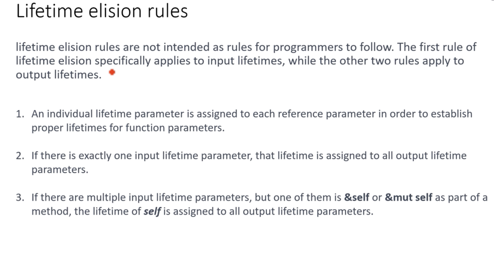

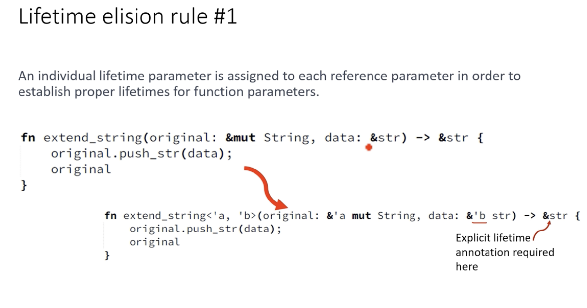

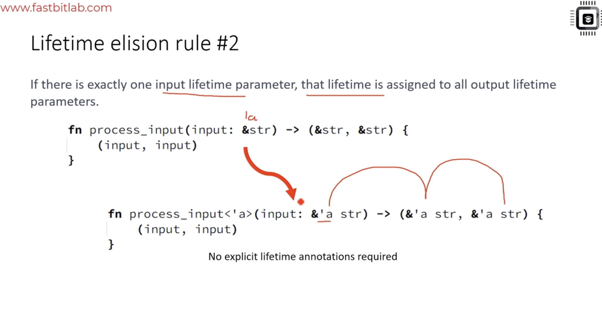

###### Lifetime annotations with structs

        struct MySTruct<'a , 'b>{
                data1 : &'a str,
                data2: &'b str,
        }

        fn main(){
                let data1 = "Hello";
                let data2 = "World";

                let my_struct = MyStruct{
                        data1: &data1,
                        data2: &data2,
                };

                println!("Data 1: {}", my_struct.data1);
                println!("Data 2: {}", my_struct.data2);

        }
###### Lifetime annotations with struct methods

        struct MyStruct<'a , 'b>{
                data1: &'a str,
                data2: &'b str,
        }

        impl <'a , 'b> MyStruct <'a, 'b>{
                fn get_data1(&self)-> &'a str{
                        self.data1
                }
                fn get_data2(&self)-> &'b str{
                        self.data2
                }

                fn set_data(&mut self, s1: &'a str, s2: &'b str){
                        self.data1 = s1;
                        self.data2 = s2;
                }
        }

        fn main(){
                let struct_ins = MyStruct{
                        data1: "Hi",
                        data1: "World",
                };
                println!("{}", struct_ins.get_data1())
        }

# 28 Const and Static variables
- constants in Rust are values that are fixed and immutable throughout the entire execution of a program
- Constants must be explicitly typed
- they are immutable
- they are known at compile time
- scoped globally
- inlined
-Lifetime are 

        const MAX_VALUE: u32 = 100;
        const MESSAGE: &str = "Hello, world";

        fn main(){
                let ref_to_const = &MAX_VALUE;
                println!("The maximum is: {}", MAX_VALUE);
                println!("Message: {}", MESSAGE);
                println!("Value: {}", ref_to_const);
        }

**static items in Rust**
- A static item is avalue that has a static lifetime , which means it is valid for the entire duration of the program's execution. Static items have a fixed memory address, and their values are accessible throughout the program

        static GLOBAL_VALUE: i32 = 42;

        fn main(){
                println!("Global value: {}", GLOBAL_VALUE);
        }

        // modifying a statix variable
        static mut MUTABLE_STATIC: i32 = 42;

        fn main(){
                unsafe{
                        //modifying mutable static requires an unsafe block
                        MUTABLE_STATIC = 10;
                        println!("Updated mutable static: {}", MUTABLE_STATIC);
                }
        }

# 29 Traits
- In Rust , Dog and Cat implement the Animal trait. 'Traits' serve the same purpose as interfaces in C++. They define a set of methods a type must implement, allowing for polymorphism and abstraction.

        trait Animal{
                fn make_sound(&self);
                type Weight;
                fn set_weight(&mut self, weight: self::Weight);
                //Self is a Rust keyword that refers to the type of the struct or the enum that implements the trait. For example, if we have a Dog struct that implements Animal trait then Self in the trait methods will refer to the type Dog
                fn get_weight(&self)->Self::Weight;
                fn set_age(&mut self, age: u8){
                        println!("This feature is not supported yet");
                }

                fn get_age(&self)->u8{
                        println("This feature is not supported");
                        0
                }
        }
        // whichever types implement this trait must give definitions for this method or set of methods

        #[derive(Default)]
        struct Dog{
                age: u8,
                weight: f32
        }

        impl Animal for Dog{
                fn make_sound(&self){
                        println!("Woof-Woof!");
                }
                type Weight = f32; // The implementation of the trait provides the concrete type for the associated type

                fn set_weight(&mut self, weight: f32){
                        self.weight = weight;
                }
                fn get_weight(&self)->f32{
                        self.weight
                }
                fn set_age(&mut self, age: u8){
                        self.age = age;
                }

                fn get_age(&self)->u8{
                        self.age
                }
        }
        #[derive(Default)]
        struct Cat{
                age: u8,
        }

        impl Animal for Cat{
                fn make_sound(&self){
                        println!("Meow!");
                }
                type Weight = u8;

                fn set_weight(&mut self, weight: u8){
                        self.weight = weight;
                }
                fn get_weight(&self){
                        self.weight
                }
        }

        fn produce_sound<T>(animal&dyn Animal<Weight = T>){
                animal.make_sound();
        }
        fn main(){
                let mut my_dog = Dog::Default();
                produce_sound(&my_dog);
                my_dog.set_age(10);
                println!("age: {}", my_dog.get_age());
        }

**Struct std::fmt::Formatter**
- The Formatter struct provides methods which you can specify the formatting options , set the width , precision, alignment, and perfom other formatting operations.
- it serves as a destination for writing formatted data:
- The formatter object is typically provided by the formatting macros(eg, println!, write!, format!), when they are called , and you don't create it explicitly yourself. It encapsulates the output stream (String , File, Standard output, etc) and provides methods for writing formatted data.

###### Trait bounds

        impl <T> Rectangle<T>{
                fn area(&self) -> T{
                        self.width*self.height //this cannot work because the multiplication is only implemented for certain types
                }
        }

        //To make it work you do this
        impl<T: std::ops::Mul<Output =T>+ Copy> Rectangle<T>{
                fn area(self)->T{
                        self.width*self.height
                }
        }
        // Alternatively
        impl<T> rectangle<T>
                where T: std::ops::Mul<Output = T>+ Copy + PartialOrd,
                {
                fn area(self)->T{
                        self.width*self.height
                }
        }
        struct Rectangle<T>{
                width: T,
                height: T,
        }

        fn main(){
                let rect1 = Rectangle{width: 5.0, height: 10.0};
                let rect2 = Rectangle{width: 7.5, height: 3.2};      
                println!("Area of rect1: {}", rect1.area());
                println!("Area of rect2: {}", rect2.area());
        }

###### Trait Objects and Virtual table
- Trait objects, vtables and dynamic dispatch are closely related concepts used to enable polymorphism and runtime method resolution
**dyn**

        let vec_shapes: Vec<&dyn Shape> = vec![&circle, &rectangle]; // here the vector borrows the trait objects 

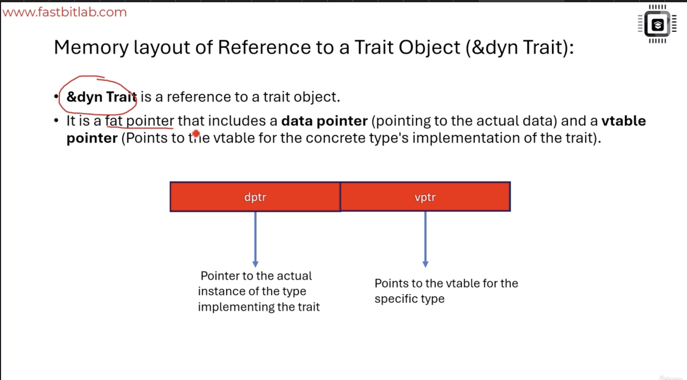
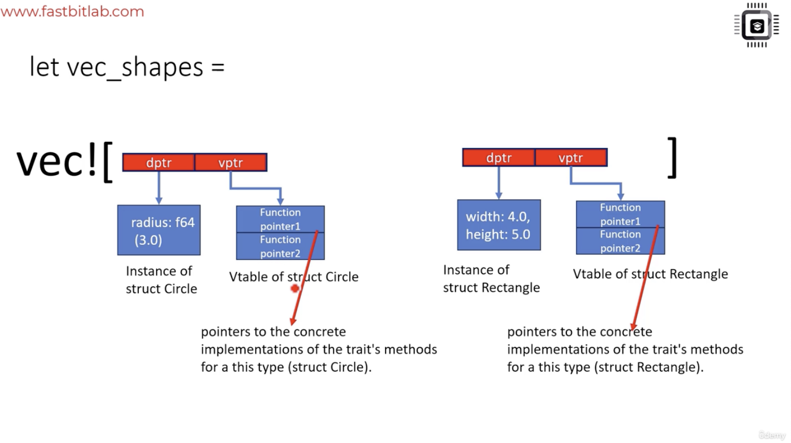

###### Virtual table(vtable)
- vtables (virtual tables ) are involved when using the trait objects
- A vtable is a mechenism used by rust to support dynamic dispatch, which allows a program to call methods on trait objects at runtime without knowingthe concrete type of the object.
- Rust compiler generates a vtables for each unique type that implements the trait

###### Boxing the DST
- Box is a heap-allocated smart pointer type that can be used to store dynamically sized types (DSTs) like trait objects(dyn Trait) and slices([T])

        let shapes: Vec<&dyn Shape> = vec![Box::new(circle), Box::new(rectangle)]; // the vextor owns the trait object

**Box<dyn Shape>**
1. Box<T> is a smart pointer thatin Rust that allows you to alocate datat on the heap rather than the stack
2. It is called a smart pointer because Box<T> can automatically handle the allocation and deallocation of heap memory
3. Box adheres to Rust's ownership principles , ensuring that that there us a single owner for the heap allocated data at any given time.
4. Basically, Box<T> encapsulates a raw pointer and makes it "smart" by adding several features and guarantees though its interface

###### Memory representatition of the Box<T>
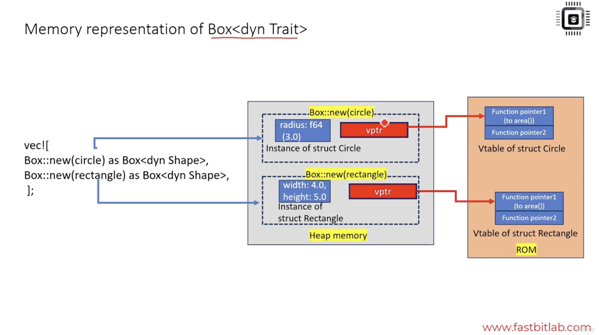

# 30 Closures
- A closure is an anonymus function that can capture values from its environment.
- Closures are a powerful tool for writing concise and reusable code in Rust. They can beused to:
1. Pass functions as arguments to other functions
2. Return functions from functions
3. Iterate over collections 
4. Write event handlers 
5. create custom iterators
6. store a function in a variable

        fn main(){
                let closure = |x: i32|-> i32{
                        return x+1;
                };
                println!("{}", closure(10));
        }

        // if it has one statment you can simplify the above with 
        // also note that RUst infers the type
        let closure = |x| x+1;

###### Closure Capturing Environment
- closures have the unique ability to capture aand use variables from their surrounding environment which allows them to reference and use variables that are defined outside their own scope. 
- while regular functions are limited to accessing only the variables passed as arguments or defined within their own scope

        fn main(){
                let x = 10; //variable in the outernscope

                //closure capturing 'x' from the outer environment

                let add = |a| a + x;
                let result1 = add(2); // closure uses 'x' from the outer scope: 2+10 = 12
                println!("Result1: {}", result1);

                let result2 = add(5); // Closure uses "x" from the outer scope : 5+ 10 = 15
                println!("Result2 : {}", result2);

        }

        fn main(){
                let mut x = 10;
                let mut print = || { // note the mut , because we are borrowing x as mut 
                        x+=1;
                        println!("Modified x: {}", x);
                };
                print();
                // The closure will return 11
                print();
                // When the closure is called again , it will return 12
        }

**Move**

        fn main(){
                let mut print;
                {
                let mut x = 10;
                // defining a closure 'print' and capturing 'x' with the 'move' keyword.
                print = move || { 
                        // closure takes ownership of 'x' and mutates it
                        x+=1;
                        println!("Modified x: {}", x);

                };
                } // The scope ends here, 'x' goes out of scope and is dropped
                print();
                // The closure will return 11
                print();
                // When the closure is called again , it will return 12
        }

###### Traits associated with closures
- Closures are often discussed in terms of the traits they implemement because closures do not have a specific type. 
- Instead, they are represented by the traits they implement, such as Fn , FnMut, FnOnce, to express their behavior in code

1. There are three traits related to closures: Fn , FnMut, FnOnce
2. All closures implement the FnOnce trait, meaning they can all be called at least once
3. The FnOnce allows a closure to consume the variables it captures from it's environment. After being called once, an FnOnce closure can not be called again as the environment has been consumed
4. If a closure does not consume its environment , it can also implement the FnMut trait. This means the closure can be called multiple times and can mutate the environment
5. If a closure does not mutate its environment, it can also implememt the Fn trait. This means that the closure can be called multiple times without mutating the environment.

###### closure trait hierachy

        Fn -> FnMut->FnOnce
1. if a closure implements Fn , it also implements FnMut and FnOnce

        fn main(){
                let x = 5;
                let closure = || x*2;

                println!("{}", closure());
                println!("{}",  closure());

                call_fn(&closure);
                call_fn_mut(&closure);
        }

        fn call_fn<F: Fn()->i32>(f:F){
                println!("Fn called: {}", F());
        }
        fn call_fn_mut<F: FnMut()->i32>(mut f:F){
                println!("Fn called: {}", F());
        }

###### Passing closure as arguments to a function
**When passing closures to functions in Rust, you generally have two options:**
1. Using function pointers:  closures that do not capture any variables from their environment can be corced to fn function pointer types. This means the closure does not hold any state and can be represented as a simple function pointer.

        fn apply(f: fn(i32)-> i32 , arg:i32)-> i32{
                f(arg)
        }

        fn main(){
                let multiply: fn(i32)->i32 = |x| x * x;

                let result = apply(multiply, 4);
                println!("{}", result);

        }
2. Using generic functions trait bounds: This method is used when your closure does capture values from its scope. These closures implement one of the Fn , FnMut, or FnOnce traits , depending on how they use the values they capture
        
        fn apply<F>(f: F, arg:i32)-> i32
        where F: Fn(i32)->i32
        {
                f(arg)
        }

        fn main(){
                let y = 2;
                let multiply = |x| x * y;

                let result = apply(multiply, 4);
                println!("{}", result);

        }

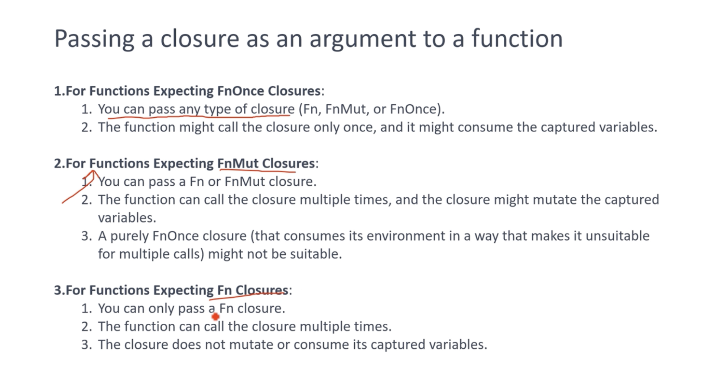

###### Mutable FnMut
        
        fn apply<F>(mutf: F, arg:i32)-> i32
        where F: FnMut(i32)->i32
        {
                f(arg)
        }

        fn main(){
                let y = 2;
                let multiply = |x| {y+=x; y};

                let result = apply(multiply, 4);
                println!("{}", result);

        }
###### Closures as struct member fields
- Storing a closure in a struct can be useful in several scenarios:
1. Event handling
2. Customizable behavior 
3. Deferred execution
4. Iterator adapters
